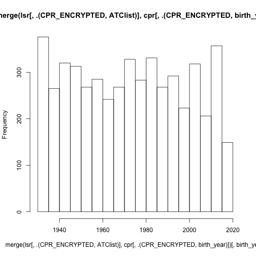
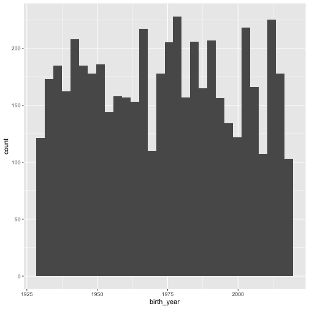

presentation 2 working with dates and generating datasets
========================================================
author: JSK@clin.au.dk
date: 15 oktober 2018
autosize: true


Todays agenda
========================================================

-working with dates in R
-generating datasets
-merging data
-generating automated flowcharts


Sourcing files
========================================================
source data files: remember R use / not \ for pathnames
When you start a session set your working directory: Session->set working directory -> choose whats appropriate like source file location get and idea of the location by using getwd()

```r
#source("filepath.R") #runs the entire syntax of the file at the filepath.
getwd() #returns your current working directory
```

```
[1] "/Users/JakobKnudsen/github/KEA-R/2 generating datasets"
```

#source() commands runs the entire content of the syntax
#now running datasets.R this syntax will return cpr and lsr datasets.

Dates
========================================================
Lubridate is a tidyverse package that works great with dates. 

```r
library(lubridate) #great package for handling dates
#call library() at start of syntax, every new session
library(dplyr) # most used, great documentation, maybe easier syntax
# a little slow with big datasets. Part of the "tidyverse"
#https://www.rstudio.com/wp-content/uploads/2015/02/data-wrangling-cheatsheet.pdf
library(data.table) #very fast and compact syntax
#contains fread() and fwrite() 
library(ggplot2) # plotting (base plots like plot() and hist () are fast and fine for exploration
```


more Dates
============================
Often one will have data saved in a character format


```r
date <- "31-01-2012"
dmy(date)
```


Dates 2
========================================================
the variables may have different positioning


```r
date <- "01-31-2012"
mdy(date) #changed order (month-day-year)
class(dmy(date))
```


Or even a combination of numeric and Character

```r
date <- "31-JAN-2012"
dmy(date)
class(dmy(date))
```


But lubridate fixes this nicely.

Dates 4
========================================================
it works with logical operators 


```r
date > dmy("31-12-2014") # and even +, - and >, <= or NOT EQUAL TO: !=
dmy("31-12-2014") - date
as.numeric(dmy("31-12-2014") - date) #and converts to numeric
year(date) # gives the year as numeric
```


merging two datasets
========================================================

```r
cpr <- fread("/Users/JakobKnudsen/github/KEA-R/2 generating datasets/cpr.csv")
lsr <- fread("/Users/JakobKnudsen/github/KEA-R/2 generating datasets/lsr.csv")
#merging two data.tables requires the function to know what key variable to merge by
setkey(lsr, CPR_ENCRYPTED)
setkey(cpr, CPR_ENCRYPTED)
cpr[,.N]
```

```
[1] 1000
```

```r
lsr[,.N]
```

```
[1] 4948
```

merging two datasets
========================================================

```r
merge(lsr, cpr)
```

```
      CPR_ENCRYPTED ATClist       EKSD DDD birth_year birth_month
   1:          AA14  E02E07 1969-05-15  60       1931           8
   2:          AA14  Z08F02 1969-05-15 120       1931           8
   3:          AA14  G07Y07 1969-05-15  30       1931           8
   4:           AA5  N06F01 2018-06-17  60       1980           9
   5:          AC42  Y02Y05 1980-12-25  30       1943           3
  ---                                                            
5088:          ZZ14  G09K04 1987-09-19  60       1949          12
5089:          ZZ14  N01I05 1987-09-19  90       1949          12
5090:          ZZ14  U06X02 1987-09-19  90       1949          12
5091:          ZZ14  G05T01 1987-09-19  90       1949          12
5092:          ZZ14  M07C08 1987-09-19  90       1949          12
      day_of_birth sex statusdato status
   1:           12   0 2101-03-13      1
   2:           12   0 2101-03-13      1
   3:           12   0 2101-03-13      1
   4:           13   0 2101-03-13      1
   5:           24   1 2101-03-13      1
  ---                                   
5088:           16   0 2030-11-26     90
5089:           16   0 2030-11-26     90
5090:           16   0 2030-11-26     90
5091:           16   0 2030-11-26     90
5092:           16   0 2030-11-26     90
```

merging two datasets - what happens?
========================================================

```r
merge(lsr, cpr)[,.N]
```

```
[1] 5092
```

```r
#longer than lsr
length(unique(cpr$CPR_ENCRYPTED))
```

```
[1] 991
```

```r
length(unique(lsr$CPR_ENCRYPTED))
```

```
[1] 894
```
merging two datasets - cpr
========================================================

```r
merge(lsr, cpr[,head(.SD,1), by = CPR_ENCRYPTED])[,.N] #takes the first "event" for each CPR_ENCRYPTED
```

```
[1] 4948
```

```r
#now the output equals the number in lsr.
#by default merge(x,y) only keeps rows that has keys[CPR_ENCRYPTED] in both dataset. Keeping the relevant portion is easy using
# all.x = TRUE, all.y= TRUE or if both all=TRUE
```
all CPR_ENCRYPTED are generated from cpr, so no CPR_ENCRYPTED exists in lsr that are not in cpr

merging two datasets - cpr and lsr
========================================================

```r
merge(lsr, cpr, all.x = TRUE)[,.N] #x=lsr, y=cpr
```

```
[1] 5092
```

```r
merge(lsr, cpr, all.y = TRUE)[,.N]#x=lsr, y=cpr
```

```
[1] 5190
```

```r
merge(lsr, cpr, all = TRUE)[,.N]
```

```
[1] 5190
```

merging two datasets - cpr and lsr
========================================================
You can decide which columns to include in the merge

```r
lsr
```

```
      CPR_ENCRYPTED ATClist       EKSD DDD
   1:          AA14  E02E07 1969-05-15  60
   2:          AA14  Z08F02 1969-05-15 120
   3:          AA14  G07Y07 1969-05-15  30
   4:           AA5  N06F01 2018-06-17  60
   5:          AC42  Y02Y05 1980-12-25  30
  ---                                     
4944:          ZZ14  G09K04 1987-09-19  60
4945:          ZZ14  N01I05 1987-09-19  90
4946:          ZZ14  U06X02 1987-09-19  90
4947:          ZZ14  G05T01 1987-09-19  90
4948:          ZZ14  M07C08 1987-09-19  90
```

merging two datasets - cpr and lsr
========================================================

```r
lsr[,.(CPR_ENCRYPTED, ATClist)]
```

```
      CPR_ENCRYPTED ATClist
   1:          AA14  E02E07
   2:          AA14  Z08F02
   3:          AA14  G07Y07
   4:           AA5  N06F01
   5:          AC42  Y02Y05
  ---                      
4944:          ZZ14  G09K04
4945:          ZZ14  N01I05
4946:          ZZ14  U06X02
4947:          ZZ14  G05T01
4948:          ZZ14  M07C08
```

merging two datasets - cpr and lsr
========================================================

```r
cpr[,.(CPR_ENCRYPTED, birth_year)]
```

```
      CPR_ENCRYPTED birth_year
   1:          AA14       1931
   2:           AA5       1980
   3:           AA6       1950
   4:          AC42       1943
   5:          AC48       1957
  ---                         
 996:          ZT62       1939
 997:          ZU21       2009
 998:          ZX70       2017
 999:          ZZ14       1949
1000:          ZZ49       2006
```

merging two datasets - cpr and lsr
========================================================

```r
merge(lsr[,.(CPR_ENCRYPTED, ATClist)], cpr[,.(CPR_ENCRYPTED, birth_year)])
```

```
      CPR_ENCRYPTED ATClist birth_year
   1:          AA14  E02E07       1931
   2:          AA14  Z08F02       1931
   3:          AA14  G07Y07       1931
   4:           AA5  N06F01       1980
   5:          AC42  Y02Y05       1943
  ---                                 
5088:          ZZ14  G09K04       1949
5089:          ZZ14  N01I05       1949
5090:          ZZ14  U06X02       1949
5091:          ZZ14  G05T01       1949
5092:          ZZ14  M07C08       1949
```

merging two datasets - cpr and lsr
========================================================
I can assign them

```r
A <- merge(lsr[,.(CPR_ENCRYPTED, ATClist)], cpr[,.(CPR_ENCRYPTED, birth_year)])
```

merging two datasets - cpr and lsr
========================================================
chain them for further operations

```r
merge(lsr[,.(CPR_ENCRYPTED, ATClist)], cpr[,.(CPR_ENCRYPTED, birth_year)])[,.N, by = birth_year]
```

```
    birth_year   N
 1:       1931  75
 2:       1980  94
 3:       1943  46
 4:       1957  68
 5:       1974  97
 6:       1992  50
 7:       2000  32
 8:       1981  82
 9:       1990  71
10:       1942  96
11:       1951  56
12:       1952  68
13:       2011  64
14:       2014  86
15:       1945  33
16:       1932  62
17:       2018  43
18:       2006  58
19:       1967 108
20:       2001  33
21:       1985 101
22:       2013  84
23:       1958  40
24:       1986  32
25:       1997  30
26:       1940  44
27:       1933  57
28:       1954  56
29:       2002  86
30:       2004  56
31:       1941  66
32:       1975  53
33:       1984  73
34:       1983  48
35:       1989  85
36:       1955  59
37:       1930  46
38:       1938  77
39:       1934  54
40:       1968  41
41:       1935  82
42:       1960  66
43:       1996  49
44:       1999  57
45:       1995  55
46:       1965  59
47:       2012  77
48:       1976  55
49:       2010  66
50:       1948  44
51:       1987  57
52:       1946  73
53:       1962  70
54:       1953  29
55:       1959  61
56:       1998  55
57:       2016  46
58:       1964  37
59:       2003  76
60:       1993  59
61:       1991  86
62:       1978  56
63:       1947  61
64:       1963  46
65:       1937  42
66:       1966  50
67:       1972  49
68:       1949  73
69:       1982  27
70:       1973  71
71:       1956  50
72:       2015  46
73:       2008  27
74:       1944  79
75:       1994  42
76:       2017  60
77:       1936  61
78:       1969  54
79:       2005  67
80:       2007  41
81:       2009  14
82:       1977  51
83:       1970  15
84:       1939  41
85:       1961  30
86:       1988  23
87:       1950  62
88:       1979  27
89:       1971  58
    birth_year   N
```

merging two datasets - cpr and lsr
========================================================
make plots

```r
hist(merge(lsr[,.(CPR_ENCRYPTED, ATClist)], cpr[,.(CPR_ENCRYPTED, birth_year)])[,birth_year])
```


and much more

merging two datasets - cpr and lsr
========================================================
by the way ggplot syntax would be

```r
merge(lsr[,.(CPR_ENCRYPTED, ATClist)], cpr[,.(CPR_ENCRYPTED, birth_year)])%>% #notice piping operator
  ggplot(.)+geom_histogram(aes(x = birth_year))
```



Creating flowcharts
========================================================

```r
library(DiagrammeR) #package for flowcharts. Graphs are primarily drawn in the DOT language using the GraphViz and `mermaid styles. :-(
# Define some sample data, and this syntax is easily adapted to a regular flowchart.
data <- list(a=1000, b=800, c=600, d=400)
DiagrammeR::grViz("
digraph graph2 {

graph [layout = dot]

# node definitions with substituted label text
node [shape = rectangle, width = 4, fillcolor = Biege]
a [label = '@@1']
b [label = '@@2']
c [label = '@@3']
d [label = '@@4']

a -> b -> c ->d 
a->d
}

[1]:  paste0('CPR Raw Data (n = ', data$a, ')')
[2]: paste0('Remove Errors (n = ', data$b, ')')
[3]: paste0('limit to population (n = ', data$c, ')')
[4]: paste0('something amazing (n = ', data$d, ')')
")
```


Excercises
========================================================
- source cpr from file datasets.R in 2 generating datasets.
- cpr may have duplicate IDs. Filter these so no two IDs has different values. (HINT: head(,1))
- fix dates in cpr (turn them into class="DATE")
- create new column in cpr that indicates what year they were born.
- remove patients dying after 2018 (too weird) hint: first condition of DATA[filter,manipulate , by =]
- create a new population called population by randomly sampling approx. 75% of cpr.
- population includes only two columns: CPR_ENCRYPTED and an indexdate
- indexdate is calculated as BIRTHDAY+365*rnorm(1, mean=60, sd = 15)
- restrict lpr so it only includes patients included in population (using merge(x,y).
- create flowchart that automatically updates to reflect N in the stages of cpr reduction to population.

push solution to github  excercice2_yourinials.R

Excercise for next time: Create labka dataset 
========================================================

- CPR_ENCRYPTED: all unqiue CPR_ENCRYPTED from cpr
- each unique CPR_ENCRYPTED should have between 0 and 15 lab-results: hint: look at how I generate lsr prescription data
- SampleDate: BIRTHDAY+365*rnorm(1, mean=60, sd = 15)
- result rnorm(1, mean=20, sd = 15)
- analysisno random number between 10.000 and 1.000.000

- save labka_yourinitals.R in lesson 2 assignment 2 folder and push to github


